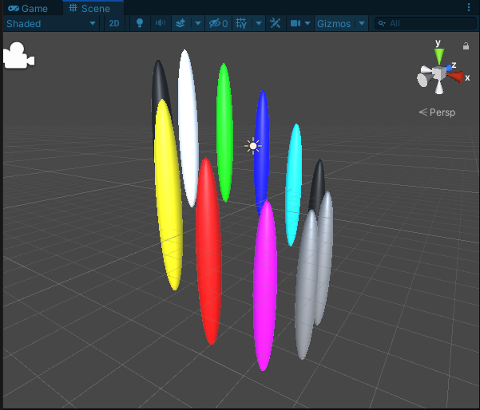
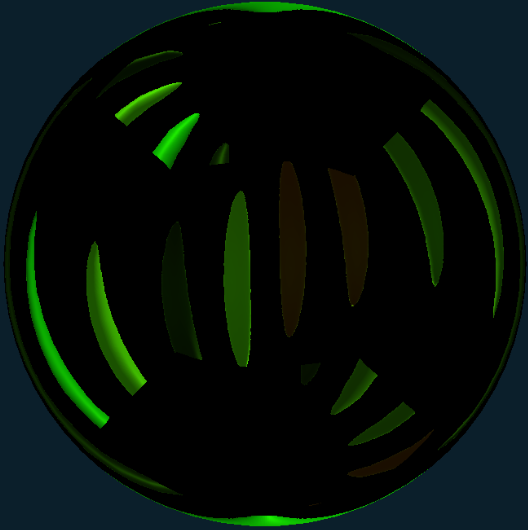
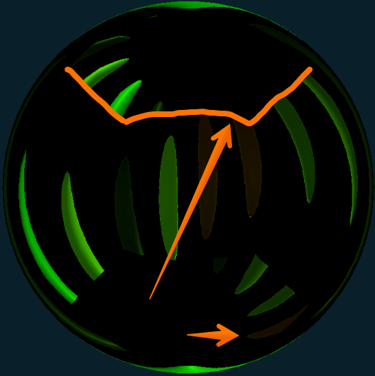

# Potential cube map bug

Given this scene...



...with a camera at the center.

Rendering into a `RenderTexture` created like this:

```
_renderTexture = new RenderTexture(512, 512, 1,  GraphicsFormat.R32G32_SFloat);
_renderTexture.useMipMap = false;
_renderTexture.autoGenerateMips = false;
_renderTexture.useDynamicScale = false;
_renderTexture.dimension = TextureDimension.Cube;
_renderTexture.filterMode = FilterMode.Point;
```

Correctly results in this:


> Note: the color change is due to the R32G32_SFloat format. That format is required for our project's usecase so I have left it as is

However when making (what appears to be) a `RenderTexture` with the same settings via a `RenderTextureDescriptor`...

```
var descriptor = new RenderTextureDescriptor();
descriptor.dimension = UnityEngine.Rendering.TextureDimension.Cube;
descriptor.width = 512;
descriptor.height = 512;
descriptor.volumeDepth = 1;
descriptor.depthBufferBits = 16; // set so it matches Approach2
descriptor.stencilFormat = GraphicsFormat.None; // set so it matches Approach2
descriptor.bindMS = false;
descriptor.msaaSamples = 1; // set as required
descriptor.graphicsFormat = GraphicsFormat.R32G32_SFloat;
descriptor.useMipMap = false;
descriptor.autoGenerateMips = false;
_renderTextureFromDescriptor = new RenderTexture(descriptor);
_renderTextureFromDescriptor.filterMode = FilterMode.Point;
```

...this is the result:



The top and bottom faces of the cubemap appear flipped to me. Here is an image I've scribbled on to show the face edge and point of interest



## To Reproduce issue

The scene in this test case shows the issue.

- Open this project in the Unity Editor
- Click the Play button
- Once running, navigate to the object named 'Test' in the inspector
- You will see two exposed RenderTexture fields. Double clicking each one will show the cubemap that has been captured by this test-case
- `Render Texture` shows the result when the `RenderTexture` was created without using a `RenderTextureDescriptor`
- `Render Texture From Descriptor` shows the result when the `RenderTexture` was created using a `RenderTextureDescriptor`

The Monobehaviour for the 'Test' object can be found here [Assets/Test.cs](Assets/Test.cs)
